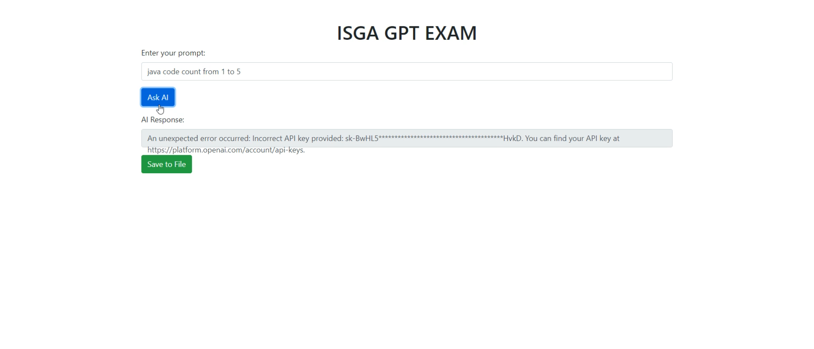
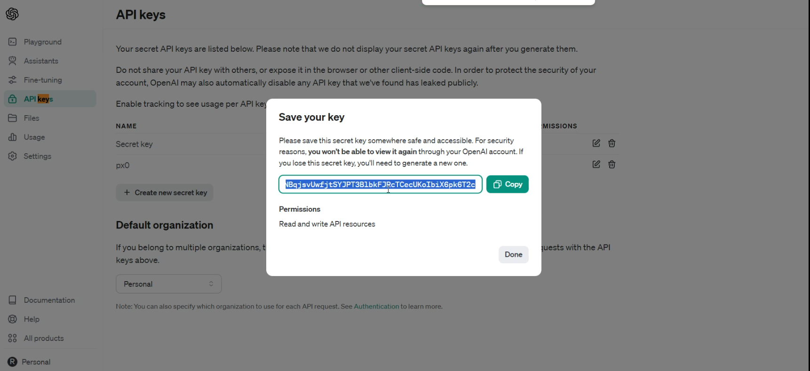
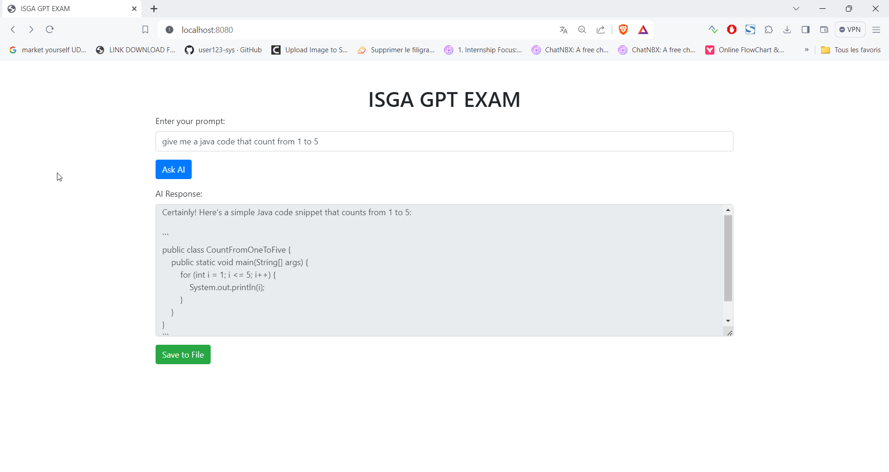
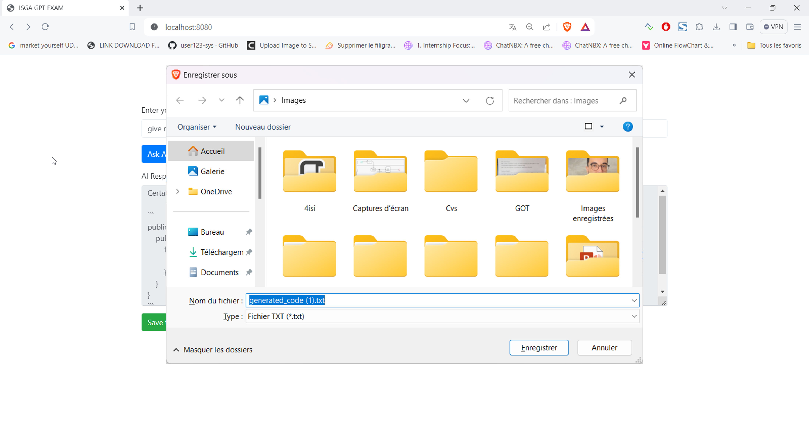
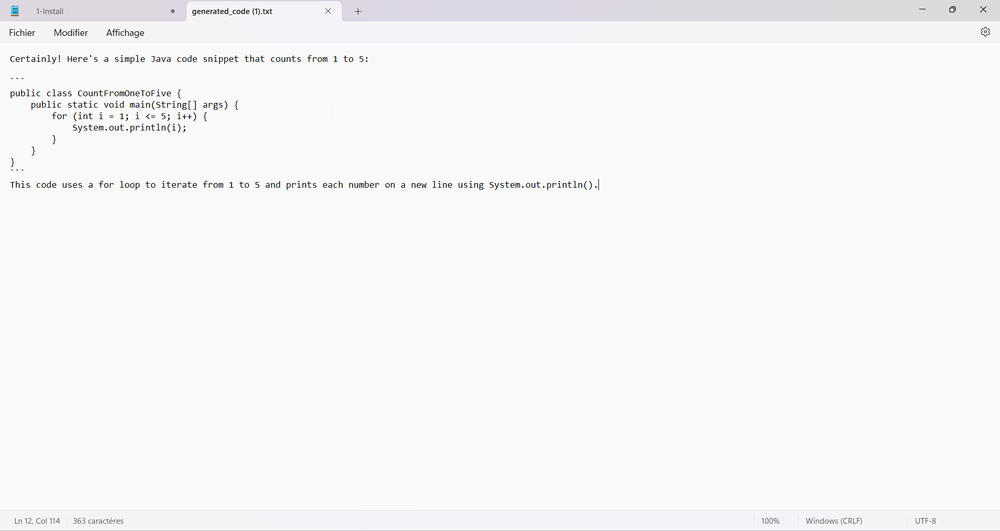

# OpenAi Integration With File Save

Ceci est une application web qui utilise le modèle GPT-3.5 pour générer du code en fonction des indications de l'utilisateur.

## Présentation du Projet

### 1. Configuration Initiale



- Le dépôt du projet a été cloné, et le site web était accessible, mais les clés d'API étaient absentes.

### 2. Générer des Clés d'API OpenAI



- Des clés d'API ont été générées depuis la plateforme OpenAI pour permettre la communication avec le modèle GPT-3.5.

### 3. Mise à Jour du Site Web avec les Clés d'API



- Les clés d'API ont été intégrées dans le site web, le rendant opérationnel pour générer du code en fonction des indications de l'utilisateur.

### 4. Sauvegarder le Code Généré dans un Fichier



- Une fonctionnalité "Sauvegarder dans un Fichier" a été implémentée, permettant aux utilisateurs de sauvegarder le code généré dans un fichier.

### 5. Visualiser le Résultat dans Notepad



- Le fichier sauvegardé a été ouvert dans Notepad, affichant le code généré.

## Démarrage

### Prérequis
- Java 17
- Maven
- Spring Boot

### Installation

1. **Cloner le dépôt :**

   ```bash
   git clone https://github.com/AnassAI/OpenAi_Integration.git
